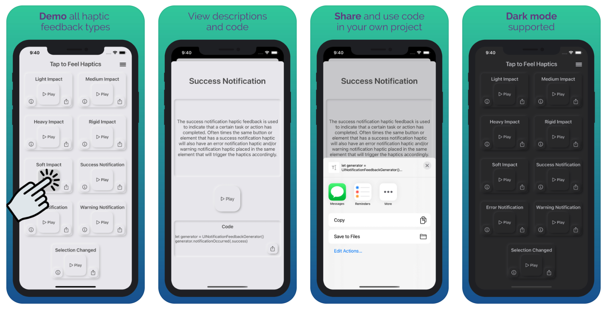

# Haptic Haven
Open source code for an app on the App Store called Haptic Haven, an app for iOS developers to test, learn about, and implement haptic feedback. Haptic feedback is a great way to improve the user experience of an application and all iOS developers should be familiar with it. Enjoy this haven for all things haptics!

**Features:**

- Demo all haptic feedback on one screen to easily compare them

- See descriptions and use cases for all 9 types built into Swift

- Share the code with yourself through Messages or email

- View helpful links with further information about haptic feedback 

**App Screenshots**

**Links:**

[Haptic Haven in the App Store](https://apps.apple.com/us/app/id1523772947)

[3rd party library for neumorphic design](https://github.com/hirokimu/EMTNeumorphicView)

[Code for all built in haptics](https://github.com/davejacobsen/Built-in-haptic-feedback-code)

Make sure to have haptic feedback turned on in your phone's Settings app: Go to Settings > Sound & Haptics > System Haptics.

**Feel free to contribute!**

Thank you for the overwhelmingly positive support for this project and helping it reach #14 on the top charts for the developer tools category at its peak!

